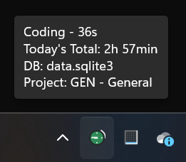
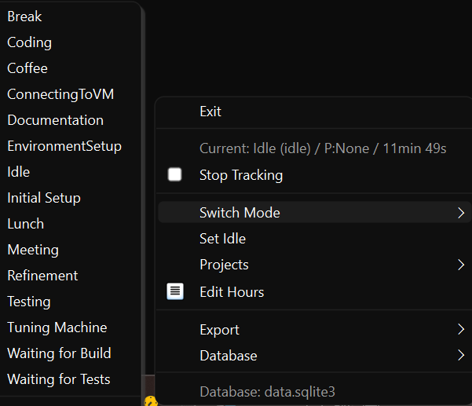

# VirtualManWeek

Once in my early life there was a great Windows program called "Virtual Man Month", which was developed by a very productive programmer in our company using purely Win32 APIs at the time. It was working from the Windows tray Icon and eveyone in the company was logging their hours to it. It was a great tool, but also a bit tedious because it recorded just the time you were at the machine. Fortunately, you could also add time manually there, which was pretty important.

This week I noticed I needed something similar, to avoid time consuming context switching and time logging using tools like Excel. This tool is not yet as production grade

Lightweight Windows system tray time tracker with mode switching, idle detection, and comprehensive reporting.



_The system tray icon showing the current time, outside the cirle showing the time worked today and hover showing the detailed summary._

So, what is going here?

1. **Database** means the main database, could represent a customer, testing database or backup. Each database contains full set of time entries.
2. **Project** optional metadata for each time entry
3. **Mode** means what is the working intention, like "Meeting", or "Coffe break" or "Waiting for the Build" - to track how much time is spent on certain kind of activies.



_The menu where you can switch the mode of working._

## About

Few notes about the implementation: I am a professional programmer, but this implementation has been programmed mostly with help of **GPT-5 Preview** and **Claude Sonnet 4**. The original plan is described in the file ORIG.md, then the actual development plan before starting in the `PLAN.md`. Not all the features that were planned were implemented in the final version, for example Azure AD login.

> **DISCLAIMER** At this point I am not an experienced Python programmer so you might see some weird things in the codebase, use at own risk and make backups of the DB regularly.

## Usage

From powershell:

```
.\scripts\dev.ps1
```

This will launch the app in the dev mode, where you can also see the logs. Requires Python to be installed.

## Key Features

- 🖥️ System tray UI with visual status (green=active, yellow=idle, red=stopped)
- 😴 Automatic idle detection and sleep/hibernate handling
- ✍️ Manual time entry with "Fill Idle Time" functionality
- 🗄️ Multiple database support ( SQLite )
- 📊 HTML and CSV export of time entries

## Requirements

- Windows 11 (Win10 likely works)
- Python 3.11+ (for development / building)

## Quick Start (Source)

1. Clone repository
2. In repo root run:
   ```powershell
   powershell -ExecutionPolicy Bypass -File scripts/setup.ps1 -Dev
   ```
3. Launch tray UI:
   ```powershell
   .\.venv\Scripts\python -m virtualmanweek.main --tray
   ```
4. Tray icon appears (Idle = yellow, Active = green, Stopped = red). Left‑click to open menu.

## Common Actions (Tray Menu)

**Mode & Project Management:**

- Switch Mode → [Mode List] : quickly switch to existing modes
- Switch Mode → Edit... : open comprehensive mode management dialog
- Set Idle : manually mark current activity as idle
- Projects → [Project List] : switch between projects
- Projects → Edit Projects... : manage projects (add/edit/archive)

**Data Export:**

- Export → CSV... : export time entries to CSV file
- Export → HTML... : generate mode distribution charts and reports

**Database Management:**

- Database → Create/Select Database : manage multiple databases
- Database → Export/Import Database : backup and restore functionality
- Database → Clear Logged Entries : reset data with confirmation

**Settings & Info:**

- Current database and project shown in tray tooltip and menu headers

## Troubleshooting & Logs

The application maintains detailed action logs for debugging purposes. Log files are stored in:

```
%APPDATA%\VirtualManWeek\action.log
```

The logs include:

- Session start/stop events with timestamps
- Mode switching and project changes
- Idle detection and recovery events
- Database operations and errors
- Sleep/wake detection and gap handling

To view recent log entries:

```powershell
Get-Content "$env:APPDATA\VirtualManWeek\action.log" | Select-Object -Last 20
```

Logs are automatically rotated (max 1MB per file, 5 backup files) to prevent excessive disk usage.

## Testing

```powershell
powershell -ExecutionPolicy Bypass -File scripts/test.ps1
powershell -ExecutionPolicy Bypass -File scripts/test.ps1 -Coverage   # add coverage
```

## Scripts Summary

| Script      | Purpose                                                       |
| ----------- | ------------------------------------------------------------- |
| setup.ps1   | Create/update virtual env & install deps (-Dev for dev tools) |
| test.ps1    | Run tests (optional -Coverage)                                |
| build.ps1   | PyInstaller build (-OneFile / -Clean)                         |
| package.ps1 | Build + ZIP + optional installer                              |

## Versioning

Defined in `virtualmanweek/__init__.py` (`__version__`). Packaging script reads this value.

## License

MIT (see `LICENSE`).
